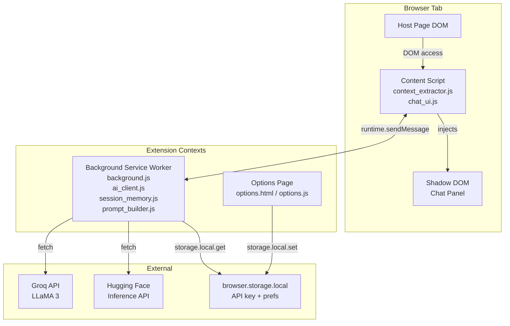

# Design Document: AI Chatbot Browser Extension

## Overview

The AI Chatbot Browser Extension is a cross-browser WebExtension (Manifest V3) that injects a floating chat panel into any webpage. When a user submits a prompt, the extension extracts visible page context, constructs a structured prompt, and sends it to a free AI backend (Groq or Hugging Face). Responses are displayed inline with a "thinking" UX. Conversation history is kept in per-tab session memory for follow-up questions.

The extension targets Chrome, Firefox, Edge, Opera, and Brave using a single shared codebase. The only browser-specific divergence is the `browser` vs `chrome` namespace, handled via a thin compatibility shim.

### Key Design Decisions

- **Manifest V3 service worker** for the background script — required for Chrome/Edge MV3 compliance; Firefox supports it via its MV3 implementation.
- **Shadow DOM** for Chat UI isolation — prevents host-page CSS from leaking into the panel and vice versa.
- **Message passing** (not shared memory) between content script and background service worker — the only communication channel available in MV3.
- **In-memory session store** keyed by `tabId` in the background service worker — satisfies the no-persistence requirement without `browser.storage`.
- **Groq as primary provider** (LLaMA 3, free tier) with Hugging Face as the secondary option — both offer free inference APIs suitable for extension use.

---

## Architecture

The extension is composed of four runtime contexts that communicate via the browser messaging API:



### Communication Flow

1. Content script injects Chat UI into Shadow DOM on page load.
2. User types a prompt and clicks Submit.
3. Content script extracts page context and sends `{ type: "PROMPT", prompt, context, tabId }` to background.
4. Background retrieves session memory, constructs full prompt, calls AI API.
5. Background sends `{ type: "RESPONSE", text }` or `{ type: "ERROR", message }` back to the content script.
6. Content script updates the Chat UI.

For streaming responses, the background sends incremental `{ type: "STREAM_CHUNK", delta }` messages.

---

## Components and Interfaces

### 1. Content Script (`content_script.js`)

Entry point injected by the manifest's `content_scripts` declaration. Orchestrates context extraction and Chat UI rendering.

**Responsibilities:**
- Bootstrap the Shadow DOM host element
- Instantiate `ContextExtractor` and `ChatUI`
- Forward user prompts to the background via `browser.runtime.sendMessage`
- Receive responses and update the UI

**Key interface:**
```ts
// Outbound message to background
interface PromptMessage {
  type: "PROMPT";
  prompt: string;
  context: ContextObject;
  tabId?: number; // populated by background from sender.tab.id
}

// Inbound messages from background
type BackgroundMessage =
  | { type: "RESPONSE"; text: string }
  | { type: "STREAM_CHUNK"; delta: string }
  | { type: "ERROR"; message: string };
```

### 2. Context Extractor (`context_extractor.js`)

Detects the current platform and extracts visible page data.

**Platform detection priority:**
1. URL hostname match (e.g., `linkedin.com`, known e-commerce domains)
2. DOM structural signals (e.g., presence of `[itemtype*="Product"]`, `article` tags)
3. Fallback: generic

```ts
interface ContextObject {
  platform: "linkedin" | "ecommerce" | "blog" | "generic";
  pageType: string;
  [field: string]: string; // all values are strings
}

interface IContextExtractor {
  extract(): ContextObject;
}
```

### 3. Chat UI (`chat_ui.js`)

Manages the Shadow DOM panel lifecycle and user interactions.

**States:** `collapsed` | `expanded` | `loading` | `streaming`

```ts
interface IChatUI {
  mount(shadowRoot: ShadowRoot): void;
  setLoading(message: string): void;
  appendChunk(delta: string): void;
  setResponse(text: string): void;
  setError(message: string): void;
  collapse(): void;
  expand(): void;
}
```

### 4. Background Service Worker (`background.js`)

Handles all message routing, session memory, and AI API calls.

```ts
// Message handler
browser.runtime.onMessage.addListener(
  (message: PromptMessage, sender, sendResponse) => { ... }
);
```

### 5. Prompt Builder (`prompt_builder.js`)

Constructs the final messages array sent to the AI API.

```ts
interface Turn {
  role: "user" | "assistant";
  content: string;
}

interface IPromptBuilder {
  build(context: ContextObject, history: Turn[], userPrompt: string): Turn[];
}
```

System prompt template:
```
You are a helpful assistant. The user is currently on a {platform} page ({pageType}).
Page context: {serialized context fields}
Answer the user's question based on this context.
```

### 6. AI Client (`ai_client.js`)

Abstracts over Groq and Hugging Face APIs.

```ts
interface AIClientConfig {
  provider: "groq" | "huggingface";
  apiKey: string;
  model: string;
  stream: boolean;
  timeoutMs: number; // default 30000
}

interface IAIClient {
  complete(messages: Turn[], config: AIClientConfig): Promise<string>;
  stream(messages: Turn[], config: AIClientConfig, onChunk: (delta: string) => void): Promise<void>;
}
```

**Groq endpoint:** `https://api.groq.com/openai/v1/chat/completions`
**Hugging Face endpoint:** `https://api-inference.huggingface.co/models/{model}`

### 7. Session Memory (`session_memory.js`)

In-memory store keyed by `tabId`. Cleared on tab close or navigation.

```ts
interface ISessionMemory {
  getHistory(tabId: number): Turn[];
  addTurn(tabId: number, turn: Turn): void;
  clearTab(tabId: number): void;
}
```

Max history: 10 exchanges (20 turns). Oldest turns are dropped when the limit is exceeded.

### 8. Options Page (`options.html` / `options.js`)

Simple HTML page with:
- API key input (password type)
- Provider selector (`groq` | `huggingface`)
- Save button → `browser.storage.local.set({ apiKey, provider })`

### 9. Browser Compatibility Shim (`browser_shim.js`)

```js
const browserAPI = typeof browser !== "undefined" ? browser : chrome;
export default browserAPI;
```

All modules import `browserAPI` instead of referencing `browser` or `chrome` directly.

---

## Data Models

### ContextObject

```ts
interface ContextObject {
  platform: "linkedin" | "ecommerce" | "blog" | "generic";
  pageType: string;
  // LinkedIn profile
  name?: string;
  role?: string;
  company?: string;
  summary?: string;
  // E-commerce
  productName?: string;
  price?: string;
  description?: string;
  // Blog / generic
  title?: string;
  headings?: string;   // comma-joined h1/h2 text
  snippet?: string;    // ≤500 chars of visible body text
}
```

All field values are strings (requirement 3.7).

### ConversationTurn

```ts
interface Turn {
  role: "user" | "assistant";
  content: string;
}
```

### StoredPreferences

```ts
interface StoredPreferences {
  apiKey: string;       // stored in browser.storage.local
  provider: "groq" | "huggingface";
  model?: string;       // optional override
}
```

### Extension Messages

```ts
// Content → Background
type ContentMessage =
  | { type: "PROMPT"; prompt: string; context: ContextObject }
  | { type: "GET_STATUS" };

// Background → Content
type BackgroundMessage =
  | { type: "RESPONSE"; text: string }
  | { type: "STREAM_CHUNK"; delta: string }
  | { type: "ERROR"; message: string }
  | { type: "NO_API_KEY" };
```

### Manifest V3 Structure

```
ai-chatbot-browser-extension/
├── manifest.json
├── background.js
├── content_script.js
├── context_extractor.js
├── chat_ui.js
├── prompt_builder.js
├── ai_client.js
├── session_memory.js
├── browser_shim.js
├── options.html
├── options.js
└── icons/
    ├── icon16.png
    ├── icon48.png
    └── icon128.png
```

`manifest.json` key fields:
```json
{
  "manifest_version": 3,
  "permissions": ["activeTab", "storage", "scripting"],
  "background": { "service_worker": "background.js" },
  "content_scripts": [{
    "matches": ["<all_urls>"],
    "js": ["browser_shim.js", "context_extractor.js", "chat_ui.js", "content_script.js"],
    "run_at": "document_idle"
  }],
  "options_ui": { "page": "options.html", "open_in_tab": true }
}
```

Note: `<all_urls>` in `content_scripts` is distinct from host permissions — it is required for the content script to run on any page and is scoped to `activeTab` for any privileged operations (requirement 8.5).

